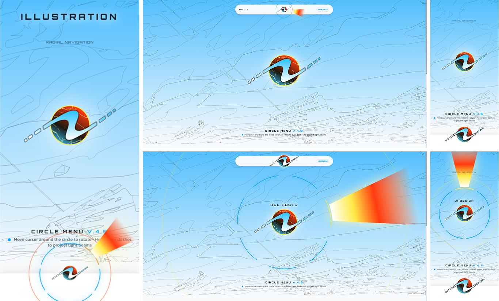

# 🎡 Circular Menu UI v.4.5 — Interactive Radial Navigation Engine

> An ultra-modern, high-performance **Circular / Radial Navigation Menu Engine** built with pure Vanilla JavaScript, trigonometric calculus, physics-based rotation inertia, dynamic tangent light beams, and mobile thumb-zone ergonomics.

<p align="center">
  
</p>

<p align="center">
  <a href="https://codepen.io/nstargina/pen/circle-menu"></a>
  <a href="https://opensource.org/licenses/MIT"></a>
  <a href="#"></a>
  <a href="https://greensock.com/gsap/"></a>
  <a href="https://tailwindcss.com/"></a>
</p>

---

## ✨ Features & Architecture

- 🎯 **Modular Multi-Instance Engine:** Reusable `CircularMenuEngine` class supporting multiple independent radial menus on the same page (Hero Radial Engine, Floating Header Capsule, Mobile Bottom Docked Nav).
- 🛡️ **Intelligent Hover Isolation:** Automatic mutual suppression between floating header capsules and background hero menus to prevent overlapping activations.
- 📐 **Real-Time Trigonometric Angular Tracking:** Pull rotation calculation via `Math.atan2(dx, dy)` and distance proximity check with `Math.hypot(dx, dy)`.
- ⚡ **Dynamic Tangent Light Beams:** Radial rays aligned tangentially to each dash sector, firing on hover/touch without alpha-blending lag. Full-coverage mouse hit-testing for effortless clickability.
- 📱 **Mobile Thumb-Zone Ergonomics:** Dual counter-rotation engine (`(baseAngle + 2 * currentAngle) % 360 == 0`) with apex locking, haptic pulses, and projected top category labels.
- 🎨 **Concentric Outer Guide Rings:** Concentric guides with 12 o'clock Apex indicator dots that maintain 100% geometric center during rotation.
- 🔗 **Direct URL Link Integration:** Built-in support for live links (`target="_blank"`), flash ripple animations, and custom callbacks (`onSelect`).
- 🎨 **SVG Symbols Vector Architecture:** SVG `<symbol>` and `<use>` vector rendering, allowing complete freedom to change dash counts, shapes, or artwork in any vector software (Figma, Illustrator, Inkscape).
- 🚀 **Zero Build Setup Required:** Runs directly via Tailwind CSS CDN + GSAP 3 CDN — 100% copy-paste ready for **CodePen**, **GitHub Pages**, **WordPress**, or any web framework.

---

## 📂 File Structure

| File | Description |
| :--- | :--- |
| [`circle-menu.js`](circle-menu.js) | **Standalone Engine Library** — Modular, UMD/Vanilla class managing physics, trigonometry, light beams, and multi-instance lifecycle. |
| [`index.html`](index.html) | **Main GitHub & Portfolio Edition** — Full responsive showcase with interactive live inspector card, multi-instance navigation, and HUD display. |
| [`codepen-index.html`](codepen-index.html) | **CodePen Standalone Edition** — 100% self-contained single-file version with inline SVG symbol definitions and zero build tools needed. |
| [`circlemenu_nstar-concepts_expo-bento-demo.png`](circlemenu_nstar-concepts_expo-bento-demo.png) | **Bento Grid Showcase Preview** — High-resolution desktop, tablet, and mobile interface demonstration. |
| [`menu-circular.md`](menu-circular.md) | Architectural documentation and component breakdown. |
| [`COMO_FUNCIONA_MATEMATICA_E_JS.md`](COMO_FUNCIONA_MATEMATICA_E_JS.md) | Mathematical formulas, trigonometry guide, and physics engine explanation (in Portuguese). |
| `img/` | Vector assets (Light beam SVG, emblem logos, background HUD textures). |

---

## 🚀 Quick Start

### 1. Run Locally
Open [`index.html`](index.html) directly in any browser or launch a local web server:

```bash
# Using Python 3
python -m http.server 8080

# Or with npx serve
npx serve .
```

### 2. Copy to CodePen
1. Open [`codepen-index.html`](codepen-index.html).
2. Copy the entire file content into the **HTML** panel on [CodePen](https://codepen.io).
3. The demo will render immediately with complete interactive physics and 60fps animations!

---

## ⚙️ Customization Guide: JavaScript Parameters

All geometric, radial, offset, and hit-testing properties are centralized inside the **`getDimensions()`** method of `CircularMenuEngine`. You can calibrate each parameter globally or pass overrides directly in options when instantiating the menu:

```javascript
getDimensions() {
    const w = window.innerWidth;
    const isDesktop = w >= 1024;
    const stageRect = this.stage.getBoundingClientRect();
    const stageW = stageRect.width || (this.isCompact ? 176 : (this.isMobileDock ? 176 : (w >= 1536 ? 737 : (w >= 1024 ? 600 : (w >= 640 ? 480 : 340)))));

    // =========================================================================
    // 1. DESKTOP FLOATING HEADER CAPSULE (isCompact)
    // =========================================================================
    if (this.isCompact) {
        return {
            stageW,
            radius: this.options.radius || 52,            // Distance (px) from center to dashes
            beamRadialOffset: this.options.beamRadialOffset ?? 2, // Radial push (px) outward from dash edge
            dashWidth: this.options.dashWidth || 36,         // Base width of the active arc
            beamSVGWidth: this.options.beamSVGWidth || 96,   // Base width of the light beam cone (full arc span)
            beamHeight: this.options.beamHeight || 90,       // Longitudinal height/reach of the light beam
            hitDistance: this.options.hitDistance || 130     // Sensitivity radius (px) for cursor activation
        };
    }

    // =========================================================================
    // 2. MOBILE BOTTOM DOCKED NAV (isMobileDock)
    // =========================================================================
    if (this.isMobileDock) {
        return {
            stageW,
            radius: this.options.radius || 78,            // Dash ring radius in the mobile bottom bar
            beamRadialOffset: this.options.beamRadialOffset ?? 3, // Push beam base flush outward
            dashWidth: this.options.dashWidth || 50,         // Dash chord width
            beamSVGWidth: this.options.beamSVGWidth || 110,  // Light beam width
            beamHeight: this.options.beamHeight || 140,      // Upward light beam projection reach
            hitDistance: this.options.hitDistance || 160     // Proximity trigger distance
        };
    }

    // =========================================================================
    // 3. MAIN HERO RADIAL ENGINE (isHero / Default)
    // =========================================================================
    const radiusRatio = isDesktop ? (359.07 / 737) : (174.99 / 360);
    const radius = Math.round(stageW * radiusRatio);

    // Dynamic responsive calibration for Hero Beam & Interaction Zone
    let beamRadialOffset = 3; // Positive value keeps beam flush outside perimeter
    let beamHeight = 620;     // Beam length
    let hitDistance = 580;    // Focused central interaction zone radius (60%~80% hero)

    if (w >= 1536) {
        beamRadialOffset = 4;
        beamHeight = 620;
        hitDistance = 580;
    } else if (w >= 1024) {
        beamRadialOffset = 3;
        beamHeight = Math.min(Math.round(stageW * 0.95), 560);
        hitDistance = Math.min(Math.round(stageW * 0.85), 520);
    } else if (w >= 640) {
        beamRadialOffset = 4;
        beamHeight = 380;
        hitDistance = 420;
    } else {
        beamRadialOffset = 3;
        beamHeight = 270;
        hitDistance = 300;
    }

    const dashRatio = isDesktop ? (208.41 / 737) : (132.47 / 360);
    const dashWidth = Math.round(stageW * dashRatio);
    const beamSVGWidth = Math.round(dashWidth * 3.86856);

    return {
        stageW,
        radius,
        beamRadialOffset,
        dashWidth,
        beamSVGWidth,
        beamHeight,
        hitDistance
    };
}
```

---

## 🎨 Concentric Outer Ring Customization

The Outer Ring provides a visual guide with an indicator marker at the 12 o'clock Apex position.

### Sizing and Alignment
In the HTML markup, the outer ring is centered with `left-1/2 top-1/2 -translate-x-1/2 -translate-y-1/2` and controlled via Tailwind width/height utility classes:

```html
<!-- Mobile Bottom Outer Ring (Concentric guide with Apex dot) -->
<div id="mobile-dock-outer-ring"
    class="absolute left-1/2 top-1/2 -translate-x-1/2 -translate-y-1/2 rounded-full border border-ns-red/80 pointer-events-none opacity-0 will-change-transform drop-shadow-[0_0_12px_rgba(255,234,71,0.7)] w-[14.5rem] h-[14.5rem]">
    <!-- Upward Apex Indicator Dot (Top 12 o'clock marker) -->
    <div class="absolute top-0 left-1/2 -translate-x-1/2 -translate-y-1/2 w-3.5 h-3.5 rounded-full bg-ns-red">
    </div>
</div>
```

- **Adjust Ring Diameter:** Simply modify `w-[14.5rem] h-[14.5rem]` (e.g., `w-[16rem] h-[16rem]` for a wider ring, or `w-[13rem] h-[13rem]` for a tighter fit).
- **Rotation Centering Integrity:** In `touchmove` and the render loop ticker, the engine ensures centering remains rock-solid by always preserving `translate(-50%, -50%)`:
  ```javascript
  this.outerRing.style.transform = `translate(-50%, -50%) rotate(${-this.currentAngle}deg)`;
  ```

---

## 📐 SVG Symbols Architecture & Vector Customization

The radial dial utilizes SVG `<symbol>` and `<use>` definitions for ultra-lightweight DOM rendering and instant vector scaling.

```html
<svg xmlns="http://www.w3.org/2000/svg" class="sr-only">
    <!-- Desktop 7 Unified Sectors (Radius: 358.99, ViewBox: 737x737) -->
    <symbol id="circle-items-desktop" viewBox="0 0 737 737">
        <circle cx="368.5" cy="368.5" r="358.99" fill="none" stroke="currentColor" stroke-linecap="round"
            stroke-linejoin="round" stroke-width="3.5" stroke-dasharray="211.43 110.80"
            transform="rotate(-106.88 368.5 368.5)" />
    </symbol>

    <!-- Desktop Active Arc Highlight -->
    <symbol id="circle-item-desktop" viewBox="0 0 737 737">
        <circle cx="368.5" cy="368.5" r="358.99" fill="none" stroke="currentColor" stroke-linecap="round"
            stroke-linejoin="round" stroke-width="4.2" stroke-dasharray="211.43 2044.19"
            transform="rotate(-106.88 368.5 368.5)" />
    </symbol>
</svg>
```

### 🖌️ How to Alter Sectors, Dash Counts or Shapes
You can edit or replace these vectors with any vector graphic design software (**Figma**, **Adobe Illustrator**, **Inkscape**, **Affinity Designer**):

1. **Changing Item Count ($N$):**
   - The perimeter of the circle is $C = 2 \pi r$.
   - Divide $C$ by the number of items ($N$). For 7 items, each sector takes $C / 7$.
   - In `stroke-dasharray="[dashLength] [gapLength]"`, adjust the dash and gap lengths to fit your desired aesthetic spacing.
2. **Custom Vector Glyphs & Shapes:**
   - Instead of a `<circle stroke-dasharray="...">`, you can place custom `<path>`, polygon vertices, icons, or futuristic cyberpunk dashes inside the `<symbol>` tags.
   - The engine will rotate and highlight whatever artwork you place inside the symbol!

---

## 🔗 Data Schema & URL Navigation

Configure items, labels, descriptions, and destination links directly in `menuData`:

```javascript
const menuData = [
    { 
        id: 'btUI', 
        label: 'UI DESIGN', 
        title: 'UI Design Patterns', 
        desc: 'Design Systems, tactile micro-interactions, and component architecture.', 
        url: 'https://nstarconcepts.com/category/ui-design/' 
    },
    { 
        id: 'btGraphic', 
        label: 'GRAPHIC DESIGN', 
        title: 'Identity & Modular Grid', 
        desc: 'Typographic hierarchy, visual balance, and brand consistency.', 
        url: 'https://nstarconcepts.com/category/design-grafico/' 
    },
    { 
        id: 'btIlustra', 
        label: 'ILLUSTRATION', 
        title: 'Vector Art & Concept', 
        desc: 'Original artwork, digital illustrations, and visual concept storytelling.', 
        url: 'https://nstarconcepts.com/category/ilustracao/' 
    },
    { 
        id: 'btAnima', 
        label: '2D ANIMATION', 
        title: 'Motion & Physics', 
        desc: 'Real-time 60fps kinetic motion graphics with vector interpolation.', 
        url: 'https://nstarconcepts.com/category/animations2d/' 
    },
    { 
        id: 'btSobre', 
        label: 'ABOUT', 
        title: 'Creative Engineering', 
        desc: 'The synergy of human-centered UX/UI Design and modern front-end technology.', 
        url: 'https://nstarconcepts.com/#about-section' 
    },
    { 
        id: 'btContato', 
        label: 'CONTACT', 
        title: 'Start Collaboration', 
        desc: 'Custom digital experiences, high-performance web apps, and bespoke interfaces.', 
        url: 'https://nstarconcepts.com/#cta-section' 
    },
    { 
        id: 'btTodos', 
        label: 'ALL POSTS', 
        title: 'Portfolio Directory', 
        desc: 'Explore the complete directory of case studies, interactive UI demos, and articles.', 
        url: 'https://nstarconcepts.com/all/' 
    }
];
```

- Clicking on any active **light beam**, **dash sector**, or **category title label** triggers a tactile ripple flash and opens the destination URL in a new tab (`window.open(item.url, '_blank', 'noopener,noreferrer')`).

---

## 🏗️ Multi-Instance Instantiation Example

To create a new circular menu instance anywhere on your page:

```javascript
const myCustomMenu = new CircularMenuEngine({
    stageId: 'my-stage-container',          // Outer container element ID
    wheelId: 'my-wheel-element',            // Rotating wheel element ID
    wheelWrapperId: 'my-wheel-wrapper',     // Wrapper for reveal transitions
    outerRingId: 'my-outer-ring',           // Concentric guide ring ID (optional)
    centerHubId: 'my-center-button',        // Center logo/button ID
    centerHubScalerId: 'my-center-scaler',  // Scaling emblem container
    triggerAreaId: 'my-interaction-zone',   // Proximity trigger bounds
    labelId: 'my-label-display',            // Active title text element ID
    fixedTopLabelId: 'my-mobile-top-label', // Top HUD projection for mobile (optional)
    flashEffectId: 'my-flash-ripple',       // Glow flash element ID (optional)
    isHero: false,                          // Enable Hero scale logic
    isCompact: true,                        // Enable compact header capsule logic
    isMobileDock: false,                    // Enable mobile bottom dock logic
    beamSVGWidth: 96,                       // Custom beam width override (optional)
    beamHeight: 90,                         // Custom beam reach override (optional)
    lerpFactor: 0.22,                       // Inertia smoothness factor (0.1 = smooth, 0.4 = snappy)
    data: menuData,                         // Item array
    onSelect: (item, index) => {
        console.log(`Selected item: ${item.label} at index ${index}`);
    }
});
```

---

## 📄 License & Author

- **Author:** [Natã da Silva Targina](https://www.linkedin.com/in/nstargina/) (NStar Concepts)
- **Portfolio & Case Studies:** [nstarconcepts.com](https://nstarconcepts.com)
- **License:** [MIT License](LICENSE) — free for personal, educational, and commercial projects.
